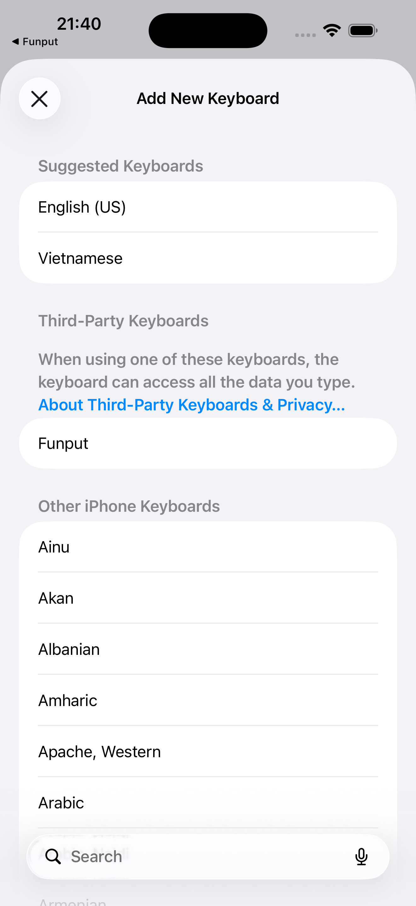
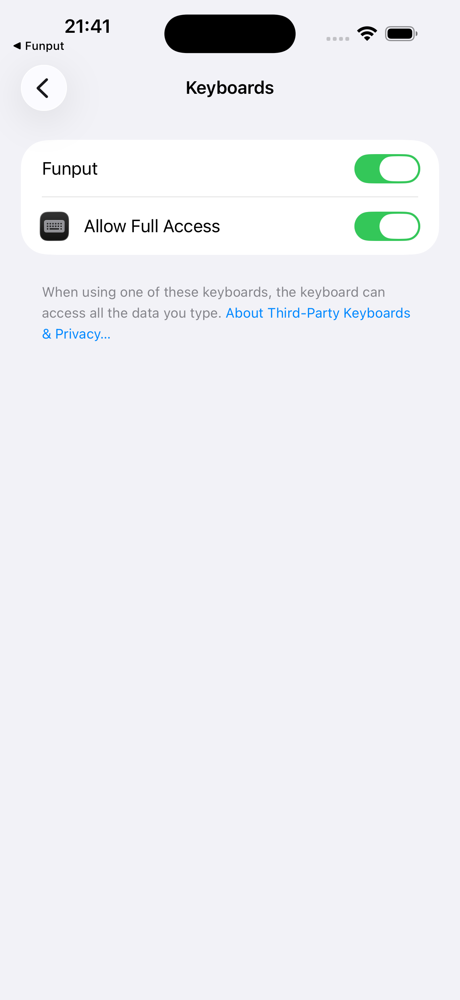
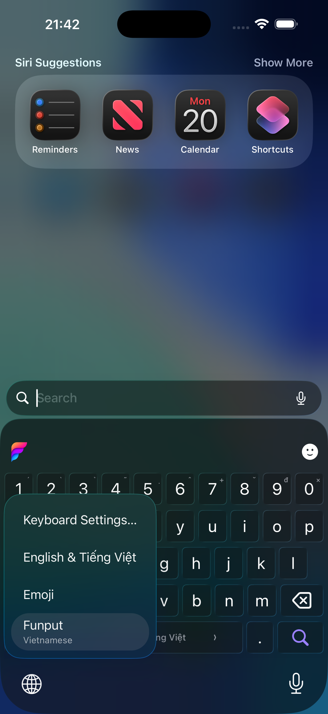

Bạn đã tải Funput nhưng khi mở Tin nhắn vẫn thấy bàn phím cũ? Đây thường là do iOS chưa được thiết lập để dùng bàn phím mới. **Cài ứng dụng và bật bàn phím là hai bước riêng**: sau khi tải Funput, bạn cần thêm nó trong Cài đặt rồi chuyển sang Funput tại ô nhập văn bản.

Bài này hướng dẫn từ lúc tải ứng dụng đến khi gõ được câu tiếng Việt đầu tiên. Ảnh minh họa lấy từ tài liệu Funput trên iPhone với giao diện tiếng Anh; bên dưới có tên mục tương ứng bằng tiếng Việt. Trên iPad hoặc phiên bản hệ điều hành khác, bố cục có thể khác đôi chút.

## Trước khi bắt đầu

Funput hỗ trợ **iPhone chạy iOS 18.6 trở lên** và **iPad chạy iPadOS 18.6 trở lên**. Bạn có thể xem phiên bản tại **Cài đặt → Cài đặt chung → Giới thiệu**.

Tải ứng dụng từ [Funput trên App Store](https://apps.apple.com/vn/app/id6788829996). Nếu đang đọc bằng máy tính, mở [trang Funput cho iOS](/ios/) và quét mã QR để đến đúng ứng dụng trên điện thoại.

Bạn không cần đổi ngôn ngữ toàn bộ iPhone sang tiếng Việt. Thêm Funput chỉ bổ sung một lựa chọn bàn phím, và bạn vẫn có thể chuyển lại bàn phím hệ thống khi cần.

## Bước 1: Mở Funput sau khi tải

Sau khi cài từ App Store, mở **Funput** từ Màn hình chính hoặc Thư viện ứng dụng. Trong tab **Cài đặt**, tìm thẻ **Hoàn tất thiết lập Funput**.

Thẻ này giúp bạn theo dõi các bước thiết lập. Bạn có thể chạm **Mở Cài đặt** để đến phần cài đặt liên quan, hoặc làm thủ công theo đường dẫn ở bước tiếp theo.

Đừng chỉ mở rồi đóng ứng dụng: lúc này iOS vẫn có thể đang dùng bàn phím trước đó.

## Bước 2: Thêm Funput vào danh sách bàn phím

Trong ứng dụng **Cài đặt** của iPhone hoặc iPad, đi theo đường dẫn:

**Cài đặt → Cài đặt chung → Bàn phím → Các bàn phím → Thêm bàn phím mới… → Funput**

Nếu máy đang dùng tiếng Anh, đường dẫn tương ứng là:

**Settings → General → Keyboard → Keyboards → Add New Keyboard… → Funput**

Chọn **Funput** trong nhóm bàn phím bên thứ ba. Nếu bạn đã thấy Funput trong danh sách các bàn phím đang dùng, có thể chuyển sang bước 3.

_Chọn Funput trong nhóm bàn phím bên thứ ba; mục Vietnamese ở nhóm gợi ý là lựa chọn khác._

## Bước 3: Hiểu và bật quyền truy cập đầy đủ

Trong phần **Các bàn phím**, chọn **Funput**, sau đó bật **Cho phép truy cập đầy đủ** — **Allow Full Access** nếu dùng tiếng Anh. Đọc thông báo của iOS rồi xác nhận nếu bạn đồng ý cấp quyền.

_Ảnh minh họa trạng thái Funput và Allow Full Access đã bật._

### Quyền này dùng để làm gì?

iOS tách ứng dụng Funput và tiện ích bàn phím thành hai phần. Theo [tài liệu cài đặt Funput](https://docs.funput.app/docs/install/ios/), quyền truy cập đầy đủ giúp hai phần chia sẻ các thiết lập như kiểu gõ, giao diện và gợi ý từ cá nhân; đồng thời hỗ trợ các tùy chọn rung, âm thanh.

Nếu không bật, bàn phím có thể không nhận đúng các lựa chọn bạn đã đặt trong ứng dụng. Đây là lý do bước này nằm trong hướng dẫn thiết lập Funput.

### Vì sao iOS hiện cảnh báo về dữ liệu nhập?

Đây là quyền có phạm vi rộng. Theo [tài liệu Apple về bàn phím tùy chỉnh](https://developer.apple.com/library/archive/documentation/General/Conceptual/ExtensibilityPG/CustomKeyboard.html), quyền mở rộng có thể cho phép bàn phím truy cập mạng và vùng dữ liệu dùng chung với ứng dụng. Vì vậy, không nên hiểu rằng quyền này chỉ có tác dụng đổi giao diện.

Còn với Funput, [chính sách quyền riêng tư](/privacy/) nêu rằng đường xử lý nhập liệu được thiết kế để không gửi nội dung bạn gõ lên máy chủ Funput, và các tùy chọn cấu hình được lưu trên thiết bị. Bạn có thể đọc chính sách và [mã nguồn Funput](https://github.com/Funput/Funput) trước khi quyết định cấp quyền.

## Bước 4: Chuyển sang Funput và gõ thử

Thêm bàn phím chưa có nghĩa ứng dụng đang nhập văn bản đã chuyển sang dùng nó. Hãy thử ở một ô nhập thông thường:

1. Mở **Ghi chú** và tạo một ghi chú mới.
2. Chạm vào vùng nhập để bàn phím xuất hiện.
3. **Chạm và giữ biểu tượng quả địa cầu** ở khu vực bàn phím.
4. Chọn **Funput** trong danh sách.
5. Gõ một câu ngắn, chẳng hạn “xin chào”.

_Ảnh minh họa menu chuyển bàn phím tại ô tìm kiếm trên iPhone. Bạn có thể thực hiện tương tự trong Ghi chú._

Chạm nhanh biểu tượng quả địa cầu có thể chuyển qua một bàn phím khác ngay lập tức. Nếu có nhiều bàn phím, thao tác **chạm giữ rồi chọn tên** sẽ giúp bạn chọn đúng Funput.

Sau khi đã mở bàn phím Funput ít nhất một lần, quay lại ứng dụng Funput. Khi bàn phím xác nhận quyền, thẻ thiết lập sẽ chuyển sang **Funput đã sẵn sàng**.

## Bước 5: Chọn Telex, VNI hoặc Telex nâng cao

Mở **Funput → Cài đặt → Bàn phím → Kiểu gõ** và chọn cách bạn quen dùng. Tên hoặc vị trí mục có thể thay đổi giữa các phiên bản ứng dụng.

- **Telex:** dùng các chữ cái để tạo dấu. Ví dụ `xin chaof` → “xin chào”.
- **VNI:** dùng các phím số để tạo dấu. Ví dụ `xin chao2` → “xin chào”.
- **Telex nâng cao / Telex+:** giữ cách gõ Telex và thêm các phím tắt như `w`, `[` và `]`, với quy tắc riêng theo ngữ cảnh.

Nếu chưa biết chọn kiểu nào, xem [bảng phím và ví dụ Telex, VNI, Telex nâng cao](/blog/telex-vni-va-telex-nang-cao/). Không cần học tất cả cùng lúc: chọn kiểu gõ quen thuộc trước rồi thử một vài câu trong Ghi chú.

## Nếu Funput chưa xuất hiện hoặc chưa gõ được dấu

### Không thấy Funput trong menu quả địa cầu

Kiểm tra Funput đã có trong **Cài đặt → Cài đặt chung → Bàn phím → Các bàn phím**. Nếu chưa có, thêm lại theo bước 2. Sau đó đóng và mở lại ứng dụng đang nhập, chạm giữ quả địa cầu và chọn Funput.

### Đổi kiểu gõ trong ứng dụng nhưng bàn phím chưa đổi

Kiểm tra **Cho phép truy cập đầy đủ**, sau đó mở bàn phím Funput trong một ô nhập để nó nhận trạng thái thiết lập. Đồng thời kiểm tra kiểu gõ đang chọn có khớp chuỗi phím bạn dùng không: `chaof` là Telex, còn `chao2` là VNI.

### Bàn phím tự đổi khi nhập mật khẩu

Theo [Apple](https://developer.apple.com/library/archive/documentation/General/Conceptual/ExtensibilityPG/CustomKeyboard.html), các ô nhập bảo mật sử dụng bàn phím hệ thống thay cho bàn phím bên thứ ba. Một số ứng dụng cũng có thể không cho phép bàn phím tùy chỉnh. Vì vậy, hãy kiểm tra Funput trong Ghi chú trước khi kết luận ứng dụng bị lỗi.

### Funput vẫn báo chưa hoàn tất thiết lập

Sau khi bật quyền, mở bàn phím Funput ít nhất một lần rồi quay lại ứng dụng. Nếu vấn đề vẫn còn, ghi lại phiên bản iOS/iPadOS, phiên bản Funput và bước đang vướng để [gửi hỗ trợ](mailto:hello@funput.app). Dùng nội dung mẫu khi mô tả lỗi; không cần gửi mật khẩu hay đoạn văn bản riêng tư.

## Muốn chuyển lại bàn phím cũ thì sao?

Chạm giữ biểu tượng quả địa cầu và chọn bàn phím bạn muốn dùng. Bạn không cần gỡ Funput để chuyển tạm thời.

Nếu muốn bỏ Funput khỏi danh sách bàn phím, vào **Cài đặt → Cài đặt chung → Bàn phím → Các bàn phím → Sửa** và xóa Funput khỏi danh sách. Việc này khác với xóa ứng dụng khỏi thiết bị.

Bạn đã sẵn sàng khi có thể chọn Funput, gõ thử đúng kiểu Telex hoặc VNI và thấy dấu tiếng Việt xuất hiện. Từ đó, hãy dùng trong những cuộc trò chuyện và ghi chú hằng ngày.

**[Tải Funput cho iPhone và iPad](/ios/)** · [Tìm hiểu Funput](/blog/funput-la-gi/) · [Tài liệu cài đặt iOS](https://docs.funput.app/docs/install/ios/)
